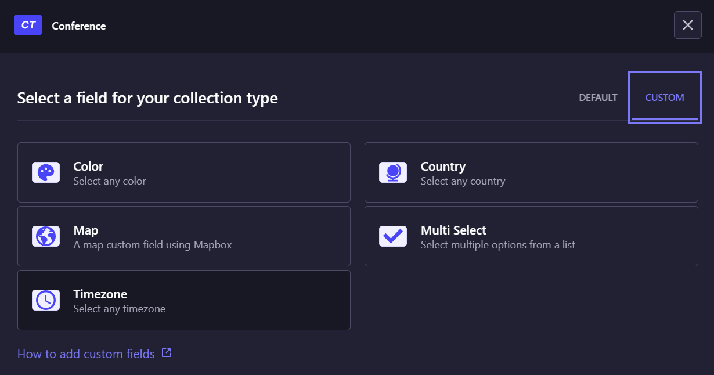
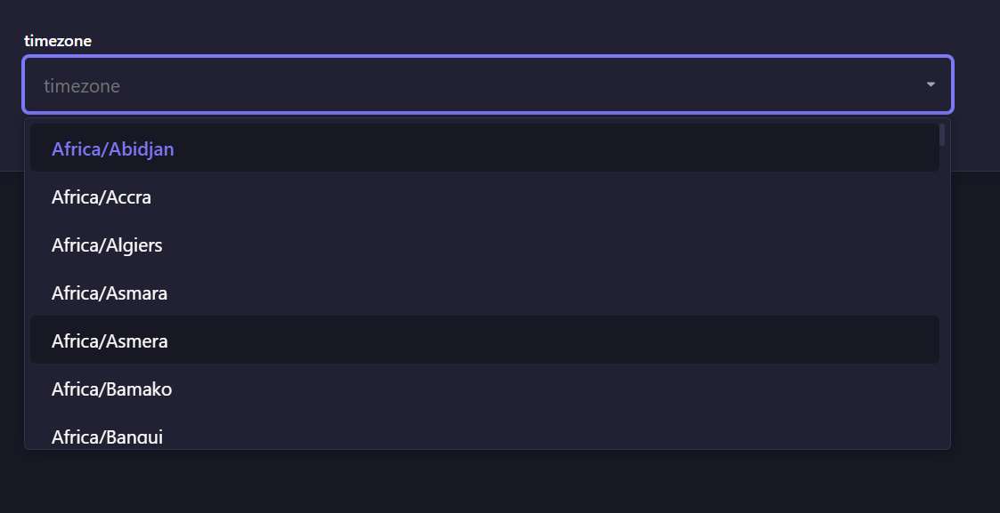

# Strapi plugin timezone-select

A Strapi custom field to select a Olson/IANA time zone.

Examples:

- Africa/Ndjamena
- America/New_York,
- Asia/Bangkok,
- Europe/Paris,
- Oceania/Sydney

## Installation

To install this plugin, you need to add an NPM dependency to your Strapi application:

```
# Using yarn
yarn add strapi-plugin-timezone-select

# Or using npm
npm install strapi-plugin-timezone-select

# Or using pnpm
pnpm install strapi-plugin-timezone-select
```

Then, you'll need to build your admin panel:

```
# Using yarn
yarn build

# Or using npm
npm run build

# Or using pnpm
pnpm build
```

## Usage

After installation you will find the timezone-select at the custom fields section of the content-type builder.



Now you can select any country from the list. The Alpha-2 code of the selected timezone is stored in the database.



## Related

This plugin is inspired by Chris Ebert's [strapi-plugin-country-select](https://github.com/ChrisEbert/strapi-plugin-country-select)
